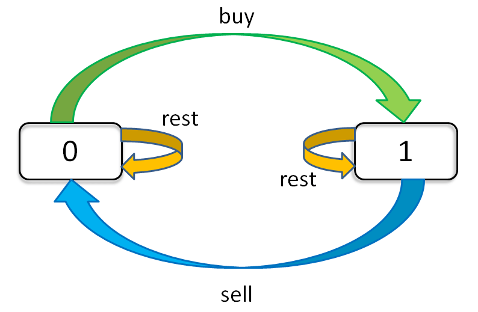

[Template Index](../template_list.md)

* 121. Best Time to Buy and Sell Stock
* 122. Best Time to Buy and Sell Stock II
* 123. Best Time to Buy and Sell Stock III
* 188. Best Time to Buy and Sell Stock IV
* 309. Best Time to Buy and Sell Stock with Cooldown
* 714. Best Time to Buy and Sell Stock with Transaction Fee

## General template

```python
for 状态1 in 状态1的所有取值：
    for 状态2 in 状态2的所有取值：
        for ...
            dp[状态1][状态2][...] = 择优(选择1，选择2...)
```            

股票交易问题的「状态」有三个，1. 天数，2. 允许交易的最大次数，3. 当前的持有状态.
每天都有三种「选择」：buy, sell, rest.


```python
dp[i][k][0 or 1]
0 <= i <= n-1, 1 <= k <= K
n 为天数，
大 K 为最多交易数, k: 已经交易次数
0/1 own stock
dp[3][2][1]: day 3, own stock, can trade 2 more times
此问题共 n × K × 2 种状态，全部穷举就能搞定。

for 0 <= i < n:
    for 1 <= k <= K:
        for s in {0, 1}:
            dp[i][k][s] = max(buy, sell, rest)
```



```
dp[i][k][0] = max(dp[i-1][k][0], dp[i-1][k][1] + prices[i])
              max(   选择 rest  ,             选择 sell      )

解释：今天我没有持有股票，有两种可能：
要么是我昨天就没有持有，然后今天选择 rest，所以我今天还是没有持有；
要么是我昨天持有股票，但是今天我 sell 了，所以我今天没有持有股票了。

dp[i][k][1] = max(dp[i-1][k][1], dp[i-1][k-1][0] - prices[i])
              max(   选择 rest  ,           选择 buy         )

解释：今天我持有着股票，有两种可能：
要么我昨天就持有着股票，然后今天选择 rest，所以我今天还持有着股票；
要么我昨天本没有持有，但今天我选择 buy，所以今天我就持有股票了。
```

```
base case：
dp[-1][k][0] = dp[i][0][0] = 0
dp[-1][k][1] = dp[i][0][1] = -infinity

状态转移方程：
dp[i][k][0] = max(dp[i-1][k][0], dp[i-1][k][1] + prices[i])
dp[i][k][1] = max(dp[i-1][k][1], dp[i-1][k-1][0] - prices[i])
```

## 121, k=1

```
dp[i][1][0] = max(dp[i-1][1][0], dp[i-1][1][1] + prices[i])
dp[i][1][1] = max(dp[i-1][1][1], dp[i-1][0][0] - prices[i]) 
            = max(dp[i-1][1][1], -prices[i])
解释：k = 0 的 base case，所以 dp[i-1][0][0] = 0。

现在发现 k 都是 1，不会改变，即 k 对状态转移已经没有影响了。
可以进行进一步化简去掉所有 k：
dp[i][0] = max(dp[i-1][0], dp[i-1][1] + prices[i])
dp[i][1] = max(dp[i-1][1], -prices[i])
```

```python
n = len(prices)
# base cases
dp = [[0] * 2 for i in range(len(prices))]
dp[0][1] = -prices[0]
for i in range(1, n):  # not from 0
    dp[i][0] = max(dp[i-1][0], dp[i-1][1] + prices[i])
    dp[i][1] = max(dp[i-1][1], -prices[i])
}
return dp[n - 1][0]
```

With space compression: 

```python
n = len(prices)
# base cases
dp_i_0 = 0
dp_i_1 = float("-inf")

for i in range(0, n):  # not from 0
    # dp[i][0] = max(dp[i-1][0], dp[i-1][1] + prices[i])
    dp_i_0 = max(dp_i_0, dp_i_1 + prices[i])
    # dp[i][1] = max(dp[i-1][1], -prices[i])
    dp_i_1 = max(dp_i_1, -prices[i])
}
return dp[n - 1][0]
```

## 122, k = infinity

如果 `k` 为正无穷，那么就可以认为 `k` 和 `k - 1` 是一样的。
```
dp[i][0] = max(dp[i-1][0], dp[i-1][1] + prices[i])
dp[i][1] = max(dp[i-1][1], dp[i-1][0] - prices[i])
```

Solution:

```python
def max_profit(prices):
    n = len(prices)
    dp_i_0, dp_i_1 = 0, float("-inf")
    for i in range(n):
        tmp = dp_i_0
        dp_i_0 = max(dp_i_0, dp_i_1 + prices[i])
        dp_i_1 = max(dp_i_1, tmp - prices[i])
    return dp_i_0
```

## 309, k = infinity with cooldown

每次 sell 之后要等一天才能继续交易。只要把这个特点融入上一题的状态转移方程即可：

```
dp[i][0] = max(dp[i-1][0], dp[i-1][1] + prices[i])
dp[i][1] = max(dp[i-1][1], dp[i-2][0] - prices[i])
解释：第 i 天选择 buy 的时候，要从 i-2 的状态转移，而不是 i-1 。
```

Solution:

```python
def max_profit(prices):
    n = len(prices)
    dp_i_0, dp_i_1 = 0, float("-inf")
    dp_pre_0 = 0  # dp[i-2][0]
    for i in range(n):
        tmp = dp_i_0
        dp_i_0 = max(dp_i_0, dp_i_1 + prices[i])
        dp_i_1 = max(dp_i_1, dp_pre_0 - prices[i])
        dp_pre_0 = tmp
    return dp_i_0
```

## 714. k = infinity with a fee

每次交易要支付手续费，只要把手续费从利润中减去即可。改写方程：

```
dp[i][0] = max(dp[i-1][0], dp[i-1][1] + prices[i])
dp[i][1] = max(dp[i-1][1], dp[i-1][0] - prices[i] - fee)
解释：相当于买入股票的价格升高了。
在第一个式子里减也是一样的，相当于卖出股票的价格减小了。
```

Solution: 

```python
def max_profit(prices):
    n = len(prices)
    dp_i_0, dp_i_1 = 0, float("-inf")
    dp_pre_0 = 0  # dp[i-2][0]
    for i in range(n):
        tmp = dp_i_0
        dp_i_0 = max(dp_i_0, dp_i_1 + prices[i])
        dp_i_1 = max(dp_i_1, dp_pre_0 - prices[i] - fee)
    return dp_i_0
```

## 123. k = 2

```python
max_k = 2
dp = [[[0] * 2 for _ in range(max_k + 1)] for _ in range(n)]
for i in range(n):
    for k in range(max_k, 0, -1):
        if i - 1 == -1:
            pass  # 处理 base case 
        dp[i][k][0] = max(dp[i-1][k][0], dp[i-1][k][1] + prices[i])
        dp[i][k][1] = max(dp[i-1][k][1], dp[i-1][k-1][0] - prices[i])
# 穷举了 n × max_k × 2 个状态，正确。
return dp[n - 1][max_k][0]
```

这里 k 取值范围比较小，所以可以不用 for 循环，直接把 k = 1 和 2 的情况全部列举出来也可以：

```java
dp[i][2][0] = max(dp[i-1][2][0], dp[i-1][2][1] + prices[i])
dp[i][2][1] = max(dp[i-1][2][1], dp[i-1][1][0] - prices[i])
dp[i][1][0] = max(dp[i-1][1][0], dp[i-1][1][1] + prices[i])
dp[i][1][1] = max(dp[i-1][1][1], -prices[i])

int maxProfit_k_2(int[] prices) {
    int dp_i10 = 0, dp_i11 = Integer.MIN_VALUE;
    int dp_i20 = 0, dp_i21 = Integer.MIN_VALUE;
    for (int price : prices) {
        dp_i20 = Math.max(dp_i20, dp_i21 + price);
        dp_i21 = Math.max(dp_i21, dp_i10 - price);
        dp_i10 = Math.max(dp_i10, dp_i11 + price);
        dp_i11 = Math.max(dp_i11, -price);
    }
    return dp_i20;
}
```