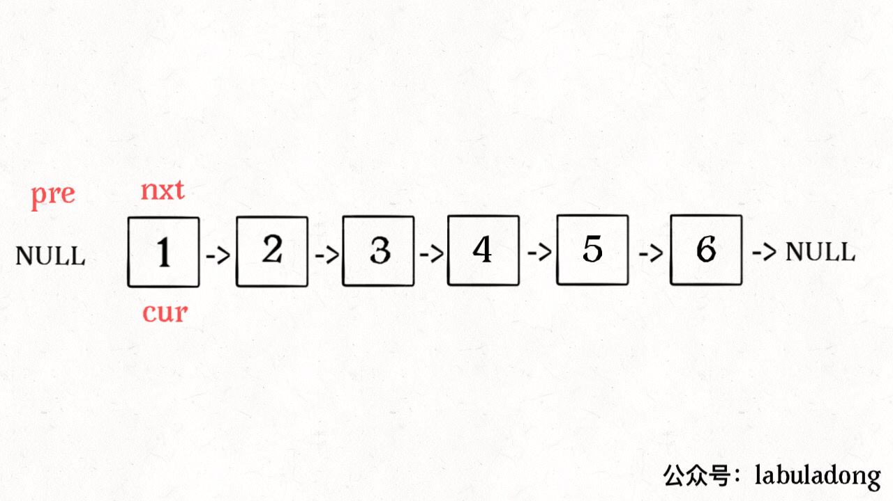

# Reverse Linked list

[Explaination Details](./summary.md) | [Template Index](../template_list.md)

## Iteration version

```python
def reverse(head):
    """ pre/cur/next, simplest solution """
    pre = None, cur = head
    while cur:
        next = cur.next
        cur.next = pre
        pre = cur
        cur = next
    return pre

def reverse(head):
    """ using dummy head is a trick to many linked list problems """
    if not head: return None
    dummy = ListNode()
    dummy.next = head
    while head.next:
        next = head.next
        head.next = next.next
        next.next = dummy.next
        dummy.next = next
    return dummy.next
```



## Recursion version

```python
def reverse(ListNode head):
    if not head: return None
    if not head.next: return head
    last = reverse(head.next)
    head.next.next = head
    head.next = null
    return last
```


### Reverse first N node

```python
successor = None
def reverseN(head, n):
    if n == 1:
        successor = head.next
        return head
    last = reverseN(head.next, n-1)
    head.next.next = head
    head.next = successor
    return last
```